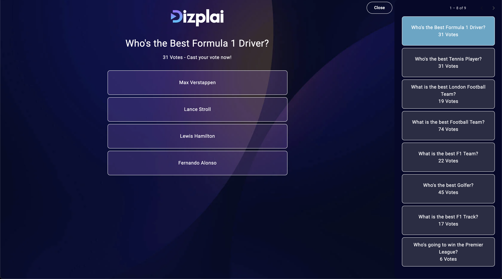
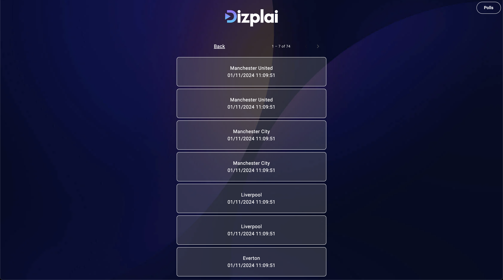

# mbramwell-dizplai-test

This is the submission for the Technical Test for Martin Bramwell.

Some assumptions/compromises have been made:
1. A Poll is active until a new Poll is created
2. Creating a new Poll deactivates the current Active Poll
3. Votes are only allowed on a Poll whilst the Poll is active
4. A user cannot vote on the same Poll twice, or change their vote
5. For simplicity, I am using the 'admin' database on Mongo along with the root user. This would not be advisable for a production system.

Demo Polls will be loaded when the application first starts up by an ApplicationRunner
[DemoDataLoader.java](polling-api/src/main/java/uk/co/mgbramwell/polling/api/DemoDataLoader.java). This will increase startup time on first Launch. This can be disabled by setting Property
value `demo.loadData=false`.

## Structure
The application is made up of an API built in Java and Spring Boot and a UI built using Angular.

## Running the Application
Both the UI and API can be run independently and instructions can be found in their respective README files.

However, the best experience will be running the applications together. To do so there is a Bash script in this repository
that will build API and start it in Docker, along with starting up the Angular UI:

```shell script
bash run.sh
```

The Docker Compose file in this directory applies to the API only. The UI will be using a standard 'ng serve'.

## Using the Application
Open your browser and navigate to http://localhost:4200 for the UI.
To interact with the API read the [API README](polling-api/README.md).

### Placing a Vote
When Accessing the UI for the first time you will be shown the current active vote.
To place a vote, simply click one of the boxes.


### Seeing Old Polls
Old Polls can be accessed by clicking the 'Polls' button on the top right hand side.
This is limited to 8 Polls per page, with Paging controls provided at the top as necessary.


The current active Poll is shown in light blue. Clicking any of the old polls will take you to
the page for that poll. You will not be able to interact with the poll (see Assumptions).


### Creating a New Poll
When a new Poll is created via the API, a websocket message is sent to lock out the current Poll
on any browser with it open. This will disable voting, and provide a button to take users to the new 
active Poll.


### Listing Votes
On any Inactive Polls, or on the current Active Poll once a vote has been placed, the votes can be listed
by clicking 'See All Votes'. This is also paged to a 7 Votes per request to avoid high data transfer when a Poll
has lots of votes.


## Cleaning Up
'ng serve' will be attached whilst running the UI. Use CTRL + C to exit.
Finally:
```shell script
docker compose down
```
